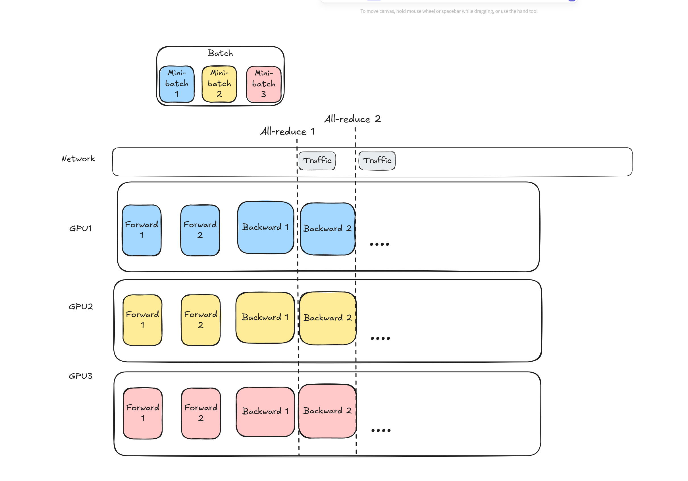
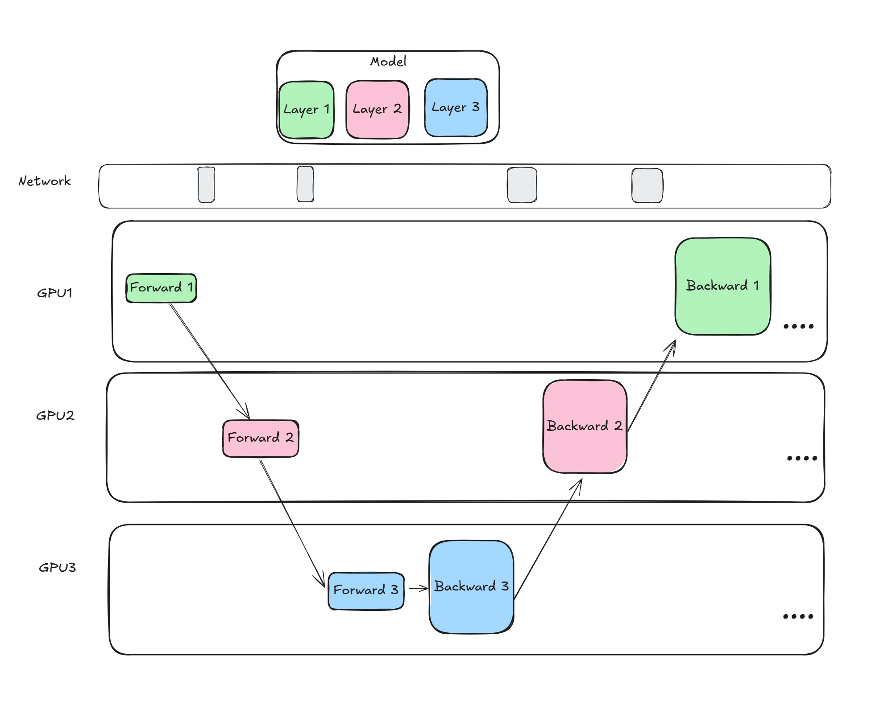
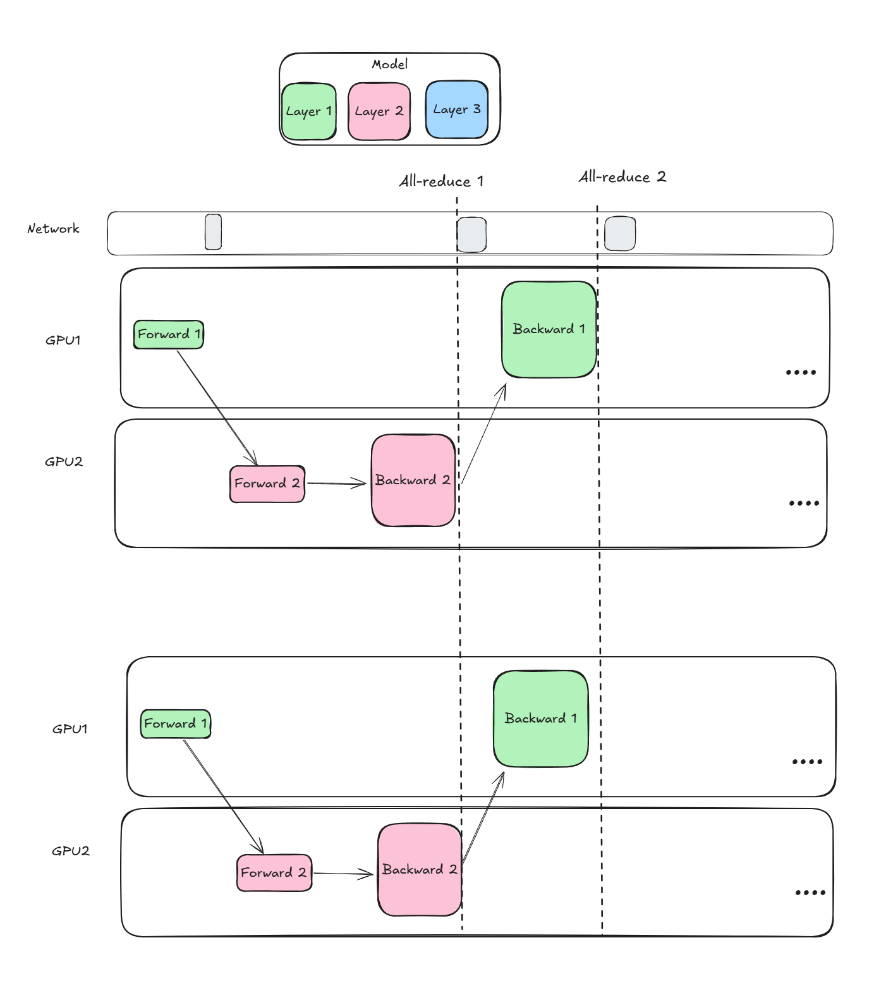

# Distributed Training Techniques

This repository provides a collection of implementations and techniques for distributed training built from scratch. It is aimed at helping practitioners understand and utilize distributed training concepts effectively.

---

## Getting Started

Follow the steps below to set up the environment and run the scripts.

### 1. Create and Activate a Conda Environment
```
conda create -n dt_env python=3.8 -y
conda activate dt_env
```
### 2. Install Dependencies
```
conda install pip -y
pip install -r requirements.txt
```
## Data Parallel Example


`torchrun --nproc_per_node=10 --nnodes=1 data_parallel_scratch.py`

--nproc_per_node: Number of processes to run on each node (e.g., number of GPUs).

--nnodes: Total number of nodes in the distributed setup (set to 1 for single-node training).

## Model Parallel Example


`torchrun --nproc_per_node=2 --nnodes=1 model_parallel_scratch.py`

--nproc_per_node: Number of processes to run on each node (e.g., number of GPUs).

--nnodes: Total number of nodes in the distributed setup (set to 1 for single-node training).


